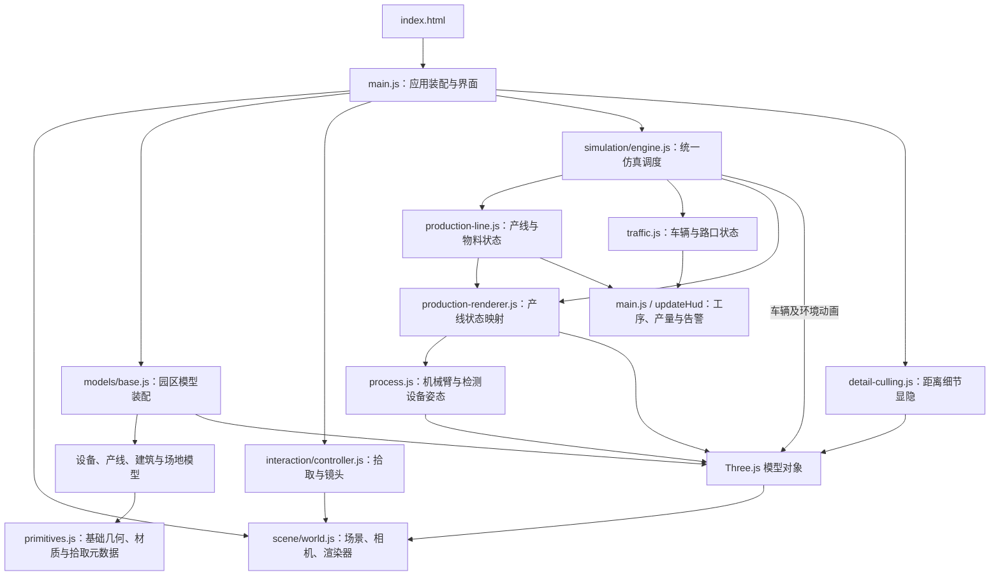
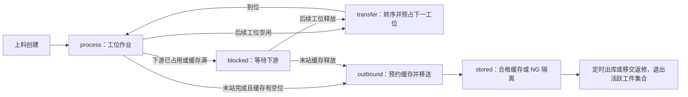

# CELLPORT · 电池模组装配基地

本地运行的 Three.js 工业虚拟仿真原型。所有设施由程序化几何生成，字体随项目打包，运行时无需访问外部资源。数据为模拟数据，未连接 PLC、MES 或真实设备。

## 启动

需要 Node.js 20.19+ 或 22.12+。

```bash
npm install
npm run dev
```

打开 http://127.0.0.1:5173 。`npm run build` 生成 `dist/`；`npm run preview` 预览构建产物；`npm test` 执行仿真验证。

## 操作

- 左键拖动旋转、滚轮缩放、右键拖动平移；点击设施或车辆进行 Raycaster 选中与平滑聚焦。
- 底部提供基地、车间、机械臂、检测、港口、模组六个镜头。自动巡游每 9 秒切换，鼠标开始操作即接管。
- 暂停冻结统一仿真时钟、工序、车辆、吊机和水面船体运动；恢复从原状态继续。支持 0.5× / 1× / 2×。
- 屋顶按钮开启全厂剖视；默认仅装配车间剖视。另有路网显示、阴影开关、视角复位和操作说明。
- 模组镜头提供分层拆解滑块及托盘、电芯、母排、上盖显隐；结构检视操作在暂停时仍可使用。
- “注入车辆故障”使 AGV-01 停车，联动红色灯光、全局告警和后车等待。再次点击恢复。

## 项目整体框架

项目是运行在浏览器中的单页三维仿真应用。`index.html` 加载 `src/main.js`，由入口统一装配界面、三维场景、交互控制器和仿真引擎。产线与交通状态保存在 JavaScript 内存中，再映射为 Three.js 对象姿态和页面指标；刷新页面会重新初始化仿真。

### 技术组成

| 层面 | 当前实现 | 用途 |
| --- | --- | --- |
| 页面与界面 | HTML、CSS、原生 JavaScript ES Modules | 页面布局、面板、按钮事件和状态展示 |
| 三维引擎 | Three.js、WebGLRenderer | 程序化模型、材质、灯光、阴影、实例化与渲染 |
| 场景交互 | OrbitControls、Raycaster | 旋转缩放、对象拾取、镜头聚焦与巡游 |
| 仿真逻辑 | `Simulation`、`ProductionLine`、`Traffic` | 固定时间步推进、工位联锁、物料流与车辆调度 |
| 视觉资源 | Lucide、Fontsource | SVG 图标，以及随构建打包的 DM Sans / Barlow Condensed 字体 |
| 开发与构建 | Vite、npm、Prettier | 开发预览、生产打包、依赖管理和代码格式化 |
| 自动验证 | Node.js 内置 `node:test` | 产线、交通、设备姿态和暂停恢复回归测试 |

当前没有 React / Vue、后端服务、数据库或设备通信层。生产数据来自本地模拟，浏览器端完成全部运行逻辑；安装依赖后，构建产物可作为静态网站提供访问。

### 架构关系

下图表示主要调用与数据流；共享工位定义同时用于产线逻辑、模型布局和界面卡片。



`production-line.js` 和 `traffic.js` 的状态推进不依赖 Three.js，可在 Node.js 中独立验证。`engine.js` 负责将逻辑与模型接起来；`production-renderer.js` 修改模型对象，最终画面由 `world.renderer.render()` 绘制。

### 完整目录结构

```text
chejianjianmo/
├── index.html                       # 页面容器与模块入口
├── package.json                     # 依赖和 dev / build / preview / test 命令
├── package-lock.json                # 依赖版本锁定
├── vite.config.js                   # 开发服务器与构建分包
├── .gitignore                       # 排除依赖、构建产物与临时文件
├── README.md                        # 使用、架构与仿真规则
├── src/
│   ├── main.js                      # 页面生成、模块装配、事件绑定、动画循环与 HUD
│   ├── style.css                    # 页面样式、面板布局和响应式适配
│   ├── scene/
│   │   ├── world.js                 # Scene、Camera、Renderer、灯光及窗口尺寸适配
│   │   ├── batching.js              # 按几何与材质合并静态实例
│   │   └── detail-culling.js        # 根据相机距离隐藏或显示微小细节
│   ├── models/
│   │   ├── primitives.js            # 基础几何、材质缓存、文字与可选中对象标记
│   │   ├── base.js                  # 园区总装：建筑、道路、港口及设备对象集合
│   │   ├── equipment.js             # 电池模组、机械臂、检测站与车辆
│   │   ├── production.js            # 七工位设施、输送线、缓存区与工件模型池
│   │   ├── details.js               # 管线、螺栓、人员、建筑、集装箱与船舶细节
│   │   ├── industrial-assets.js     # 标牌、叉车、预处理设备、服务设施与船体
│   │   └── site-details.js          # 仓库内部、车间细节及园区配套建模函数
│   ├── simulation/
│   │   ├── engine.js                # 统一时钟、暂停、倍速与各子系统调度
│   │   ├── production-line.js       # 工位定义、工件状态、预约、分流和统计
│   │   ├── production-renderer.js   # 工件状态到模型姿态、夹持关系与信号灯的映射
│   │   ├── process.js               # 工序阶段、机械臂运动学与检测夹具动作
│   │   └── traffic.js               # 圆角路线、车辆跟车、路口预约与故障处理
│   └── interaction/
│       └── controller.js            # 视角预设、相机控制、拾取、高亮与自动巡游
├── tests/
│   ├── simulation.test.js           # 交通、净空、设备接触和基础暂停测试
│   └── production.test.js           # 物料守恒、工位联锁、夹持与产线渲染同步测试
├── artifacts/
│   ├── verification.md              # 初版验证记录
│   ├── refinement-verification.md   # 场景细化验证记录
│   ├── production-flow-verification.md # 产线流程验证记录
│   └── *.png                        # 场景与设备验证截图
├── node_modules/                    # 本地安装的依赖，不提交 Git
└── dist/                            # npm run build 输出，不提交 Git
```

### 启动与每帧运行流程

1. **创建页面**：`main.js` 加载字体、样式和图标，生成三维视口及控制面板。
2. **建立场景**：`createWorld()` 创建场景、相机、渲染器和灯光；`createBase()` 装配园区，返回供仿真与交互共用的 `models` 对象。
3. **初始化状态**：`new Simulation(models)` 创建交通与产线控制器。产线按固定步长预运行 38 秒，形成在制工件，再通过 `step(0)` 同步初始画面。
4. **连接交互**：创建细节显隐控制器和相机控制器，绑定暂停、倍速、出库、故障、工位聚焦、拆解和屋顶等操作。
5. **推进仿真**：`requestAnimationFrame()` 调用 `sim.update(dt)`。引擎将单帧真实时间限制到 0.1 秒以内，乘以倍速后累积，再以 `1/60` 秒步长推进。
6. **同步画面**：每个仿真步先更新交通与产线状态，再更新工件、机械臂、检测站、车辆及环境动画。随后更新相机和细节显隐，调用渲染器绘制场景。
7. **刷新界面**：每帧更新场景标签位置，每 150ms 更新工序与统计面板，每约 1 秒更新 FPS 和 draw calls。细节显隐每 200ms 检查一次。

全局暂停停止仿真状态推进，相机和界面仍可操作；暂停出库仅停止合格缓存的定时出库，NG 返修移交仍按自身时序运行。切回后台页面时，引擎限制单帧时间，避免补算整段离开时间。

### 核心数据与状态流

| 数据对象 | 管理模块 | 内容与用途 |
| --- | --- | --- |
| `world` | `scene/world.js` | 场景、相机和渲染器，由主循环与交互控制器使用 |
| `models` | `models/base.js` | `robots`、`inspect`、`module`、`vehicles`、`production`、`pickables`、屋顶及环境节点等对象引用 |
| `Simulation` | `simulation/engine.js` | 统一时间、暂停、速度、时间累积量、拆解状态，以及 `line` / `traffic` 实例 |
| `ProductionLine` | `simulation/production-line.js` | 工位占用、活跃工件 `jobs`、缓存 `bins`、槽位预约 `reservations`、事件与累计统计 |
| 工件 `job` | `simulation/production-line.js` | 唯一编号、工位、运行模式、阶段时间、位置、母排 / 上盖装配状态、检测结果和流转记录 |
| 工件模型 `actor` | `models/production.js`、`production-renderer.js` | 预建 16 个可复用模型，通过 `jobId` 对应活跃工件，随夹持在园区和夹爪节点间切换归属 |
| `Traffic` | `simulation/traffic.js` | 8 辆车的路线位置、速度、故障与等待状态，以及共享路口占用者 |

工件的主要运行模式如下，工序完成后根据下游是否可接收决定转序或等待：



工位从下游向上游更新；转序启动时即占用下一工位，进入缓存前先预约槽位，避免多个工件竞争同一位置。工件到达合格缓存后才增加 `good`，NG 到达隔离区后增加 `rejected`；合格出库单独增加 `shipped`。HUD 读取这些状态，展示产量、在制数量、检测通过率与阻塞情况。

设备动作由同一份工件状态驱动：产线控制器确定工序和位置，映射层设置机械臂目标、检测夹具、工件父节点及部件显隐。交通系统在同一仿真时钟下独立推进，目前没有接收产线出库运输任务。

### 渲染、交互与性能职责

- **程序化建模**：基础几何与材质集中复用，复杂设备由多个基础部件组合；`base.js` 负责装配和对外提供对象引用。
- **静态合批**：`batchStatic()` 合并同级中可合并的网格及已有实例。可选中、动态、距离裁剪、带子节点或透明材质对象会被跳过，保留独立行为。
- **对象交互**：模型通过 `selectable()` 写入拾取信息并加入 `pickables`，控制器处理 Raycaster 点击、包围盒高亮及平滑镜头移动，回调交给 `main.js` 更新面板。
- **显示控制**：屋顶、顶部桁架、路线与模组层级由界面操作控制；微小几何通过 `detailRange` 标记按相机距离显示。
- **渲染预算**：设备像素比限制为 1.7，使用一个投影方向光和固定 2048² 阴影贴图；Vite 将 Three.js、图标拆为独立构建块。

### 开发、验证与扩展入口

| 需要调整的内容 | 主要修改位置 | 关联检查 |
| --- | --- | --- |
| 页面布局、按钮或指标 | `main.js`、`style.css` | 面板状态、窄屏布局及交互反馈 |
| 园区设施、设备外观 | `models/` 对应文件，必要时更新 `base.js` | 拾取对象、动态节点标记、车道和工件净空 |
| 工位顺序、节拍与缓存 | `production-line.js`、`models/production.js`、`production-renderer.js` | 工位索引、界面容量文案、姿态时序与产线测试同步调整 |
| 机械臂动作或检测姿态 | `process.js`、`production-line.js`、`production-renderer.js` | 可达范围、拾取落位连续性、探针接触与夹持关系 |
| 路线、车辆数量或交通规则 | `traffic.js`、`models/base.js`，以及 `main.js` 中对应展示 | 仿真车辆与模型数量一致、跟车间距、路口释放和设施净空 |
| 镜头预设与点击聚焦 | `interaction/controller.js`、模型拾取元数据 | 视角目标、遮挡和鼠标接管巡游 |

工位坐标、节拍与输出槽位集中定义在 `production-line.js`，但设备映射和界面仍包含固定工位索引与容量文案，新增工位需要联动修改这些使用位置。

开发时使用 `npm run dev`，默认地址为 `http://127.0.0.1:5173`，端口被占用时直接报错。提交功能改动前运行 `npm test` 和 `npm run build`；自动测试覆盖产线物料守恒、30 分钟持续通行、阻塞恢复、净空、设备姿态和暂停同步，视觉与操作检查记录在 `artifacts/`。`npm run preview` 用于本地检查构建结果。

浏览器控制台可调用 `window.__twin.snapshot()` 查看仿真时间、暂停状态、车辆状态、最小观测间距、绘制调用数及产线快照；`window.__twin` 同时暴露 `world`、`models`、`sim` 和 `controller` 供调试。

后续如需接入 PLC / MES、保存历史数据或建立 AGV 搬运任务，应新增通信与数据适配层，并明确模拟状态与真实设备状态的来源及控制边界。这些能力尚未实现；当前上料、出库和返修均采用模拟边界事件。

## 仿真规则

产线按“上料扫码 → 机械臂上料 → 叠装压合 → 母排连接 / 上盖锁付 → 机械臂转序 → EOL 检测 → 合格 / NG 分流”运行。每个模组使用唯一编号，工位占用包含来料预约，下游未释放时上游等待。开场通过 38 秒预运行形成合理在制状态。产量只在合格品进入缓存后累加；界面显示本轮在制、通过率、出库和隔离数量。

机械臂周期 8.8 秒，包含等待、抓取、搬运、落位和回位。两连杆逆运动学及腕部反向回转保持模组方向，夹持时工件属于夹爪节点，落位后交回输送线。上料区有净空联锁，避免拥堵恢复时重叠补料。此模型为简化搬运机构，未标定真实六轴机器人。

压合头按到位、压合、抬升动作运行；母排和上盖逐层加入，然后锁付。检测站夹具横向夹持，探针下降接触上盖、检测、反馈、释放；每第 7 件设为模拟绝缘 NG。检测完成后才允许离站，NG 进入独立隔离区，绝不计入合格产量。

合格缓存 3 位、NG 缓存 2 位，移动中的工件预占目标槽位。点击车间流程面板中的“暂停出库”可观察缓存满后七个工位逐级等待；恢复后按空位继续。点击工序卡片可聚焦。出库 / 返修移交采用定时边界事件，尚未与厂外 AGV、仓库或港口建立任务交接；上料的电芯套件及母排、上盖供应也采用模拟边界，不模拟完整 BOM 库存。

8 辆车辆使用两条圆角规划路线。交通控制包含加速限制、同车道跟车、共享路口区域独占预约、安全包络及故障停车。预约持有到实际进入并离开区域，故障占用中的区域保持封锁。模型属于运动学调度演示，不是刚体物理或通用道路规划求解器。

新增 `production-line.js` 管理物料与工位，`production-renderer.js` 映射设备和工件姿态，`models/production.js` 构建产线设施。`tests/production.test.js` 验证物料守恒、工序顺序、缓冲容量、NG 分流、阻塞恢复、夹持连续性、工件净空和暂停。

## 画面与性能

统一路面网格消除十字交叉处重叠面；标线和屋顶文字具有独立高度/深度偏移。几何与材质缓存复用，静态设施按几何和材质批量实例化，电芯、货架、堆箱、树冠和路面标线实例化。仅一个方向光投影，固定 2048² 阴影图与稳定范围，设备像素比上限 1.7。界面每 150ms 更新，仿真采用 1/60s 固定步长；切回后台页面不补跑长时间积压。

验证包含 30 分钟交通仿真，检查每辆车在最后一分钟仍持续通行；故障与恢复场景；建筑和堆箱净空；工件夹持坐标与落位连续性；探针接触高度；暂停与恢复。性能数值取决于设备、窗口尺寸与视角，可在右下角查看 FPS 与 draw calls。

## 细化版场景

- 厂房新增立面压型板、装卸月台、卷帘门、光伏阵列、空调风机、雨水管、结构桁架及区域标牌。设备近景自动隐藏头顶桁架，避免遮挡。
- 装配区新增滚筒输送线、移动载具、工具台、防护网、控制柜与作业人员。机械臂增加轴承端盖、护板、线缆、夹爪导轨和安装螺栓。
- 模组增加液冷底板流道、端子、隔片、母排接头、采集板、紧固件和铭牌；细节随所属拆解层同步移动和显隐。
- 检测站增加导向柱、夹具滑块、探针座、操作终端、急停按钮与线缆；活动部件明确排除在静态合批之外。
- 物流车辆增加箱式、托盘式、牵引式三种造型，轮胎按行驶速度转动。独立叉车为装卸待命静态展示，未接入车辆路网。
- 仓库采用立柱、横梁、托盘与多种货箱组成的货架；预处理车间设三组设备和旋转风机。点击分区可自动打开对应屋顶。
- 港口新增波纹集装箱、门锁杆、护角、编号、吊机桁架、爬梯与驾驶室。船体使用带船艏的挤出几何，增加甲板护栏、绞盘、救生艇、桅杆、岸边防撞设施和航标。
- 场地增加充电位、门岗、消防栓、监控杆、围栏、配电柜和绿化。

新细节继续复用几何体和材质，静态实例会再次合并；动态节点和带子节点的网格不会被错误烘焙。新增设施纳入车道净空回归，三种车辆均验证在 3m 水平安全半径内，并检查轮胎贴合路面。

总览距离下自动省略微小螺栓、轴承环和线缆，进入近景后恢复显示；每 200ms 更新一次细节可见性，不改动仿真状态。码头平台已延伸到吊机外侧支腿下方，同时保持港口车道净空。
